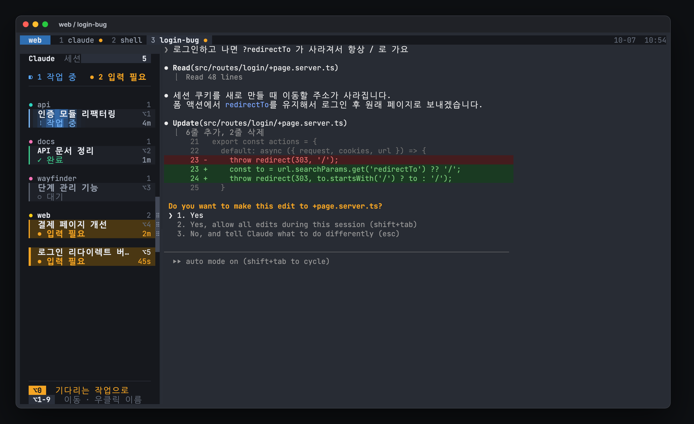
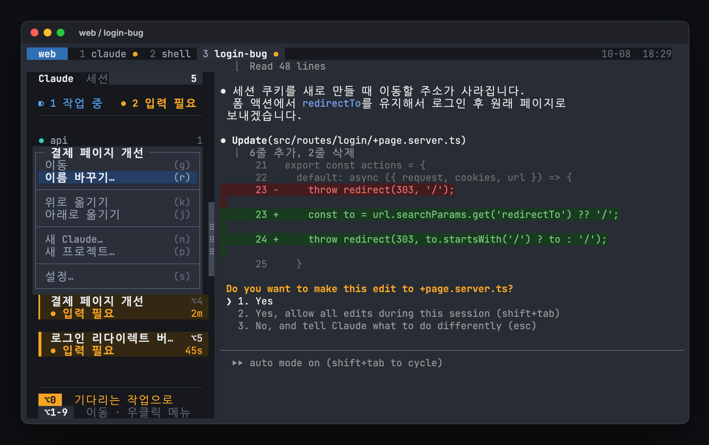
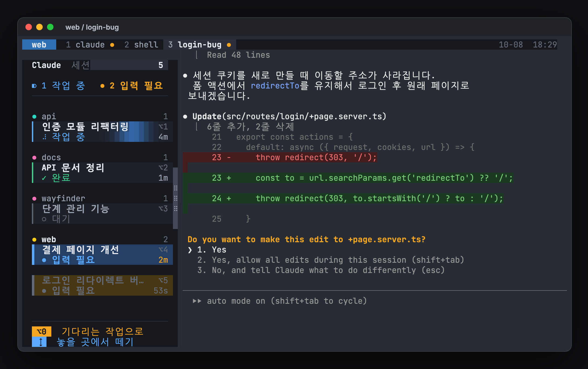
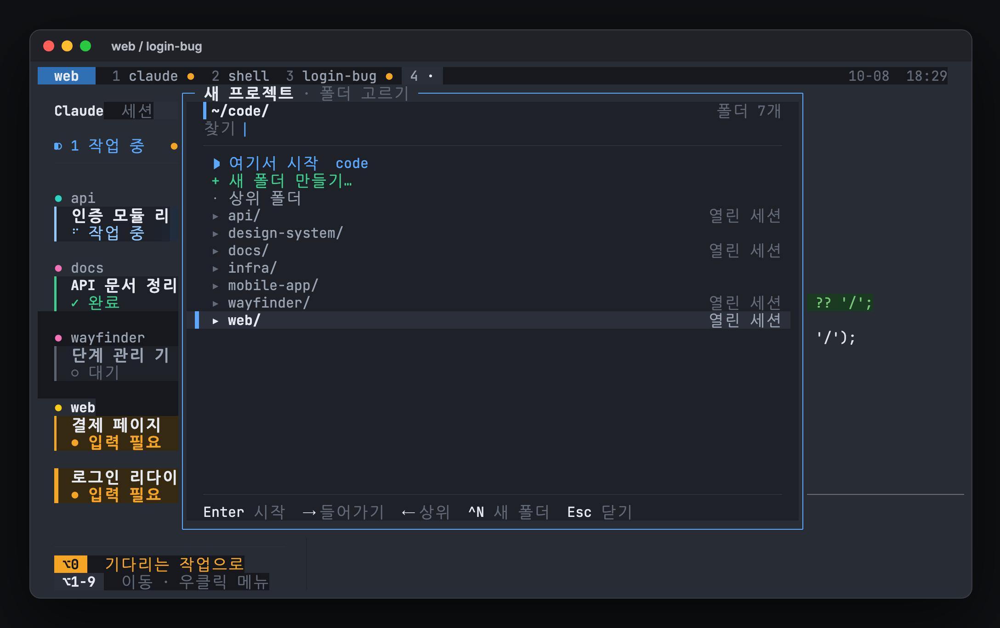
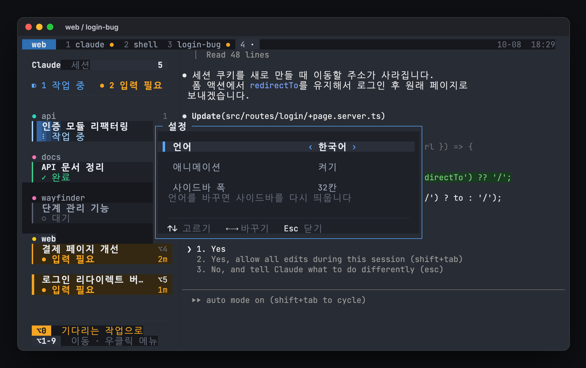

# hivemux

[English](README.md) · **한국어**

**Claude Code 세션 다섯 개를 동시에 돌려도, 지금 나를 기다리는 작업이 무엇인지 한눈에 봅니다.**

hivemux는 모든 tmux 창 왼쪽에 사이드바를 붙입니다. 사이드바에는 모든 tmux 세션의 Claude Code 세션이 나옵니다. 각 세션이 무슨 작업을 하는지, 작업 중인지, 승인을 기다리는지, 끝났는지, 얼마나 지났는지 보입니다. `Option+3`을 누르면 세 번째 작업으로, `Option+0`을 누르면 가장 오래 기다린 작업으로 바로 갑니다. 터미널을 닫거나 Mac을 재부팅해도 모든 화면이 돌아오고, 각 칸의 Claude가 원래 대화로 다시 열립니다.

<p align="center">
  
</p>

## 기능

- **모든 세션을 한 판에:** 프로젝트별로 묶인 카드에 실시간 상태와 경과 시간을 보여 줍니다. 작업 중인 카드는 빛 띠가 지나가고, 입력이 필요한 카드는 호박색으로 깜빡입니다.
- **어디로든 바로 이동:** `Option+1`부터 `Option+9`까지, `Option+0`(가장 오래 기다린 작업), 카드 클릭으로 이동합니다.
- **작업 이름:** Claude가 정한 대화 제목을 보여 줍니다. 카드를 더블클릭하거나 오른쪽 클릭 메뉴의 "이름 바꾸기"로 이름을 바꿀 수 있습니다. 바꾼 이름은 `/rename`으로 Claude에 전달되고, Claude가 작업 중이면 끝날 때까지 기다렸다가 보냅니다.
- **원하는 순서:** 카드를 끌어 작업 순서를, 프로젝트 이름 줄을 끌어 프로젝트 순서를 바꿉니다. `Option+숫자` 번호와 맨 위 창 목록도 같은 순서를 따릅니다.
- **끊기지 않음:** 터미널을 닫아도 tmux가 세션을 살려 둡니다. 재부팅하면 tmux-resurrect가 배치를 복원하고, hivemux가 알맞은 칸에서 `claude --resume <id>`를 실행합니다.
- **프로젝트:** `hm ~/code/api`로 폴더 하나에 tmux 세션 하나를 엽니다. 이름 붙인 Claude 창과 셸 창이 함께 생깁니다.
- **Claude가 말한 경로 열기:** `Option+O`를 누르면 그 칸의 최근 출력에 나온 파일 경로가 목록으로 나옵니다. Enter를 누르면 VS Code에서 그 줄로 열립니다.
- **폰에서:** 원하면 모든 세션의 Remote Control을 켭니다. Claude 앱에서 같은 세션을 보고 조작할 수 있습니다.
- **설정을 덮어쓰지 않는 설치:** 기존 설정 파일에 표시된 블록만 추가하고, `hivemux uninstall`로 그 블록만 정확히 지웁니다.

## 필요한 것

- macOS (Linux도 동작할 가능성이 높지만 시험하지 않음)
- tmux 3.3 이상, jq, git, python3 (Xcode Command Line Tools)
- 로그인된 [Claude Code](https://code.claude.com)
- [Ghostty](https://ghostty.org) 권장 (다른 터미널에서도 `tmux`를 직접 실행하면 동작)

## 설치

```sh
curl -fsSL https://raw.githubusercontent.com/esteban-eg-kim/hivemux/main/install.sh | bash
```

hivemux를 `~/.local/share/hivemux/src`에 받고 `hivemux setup`을 실행합니다. 같은 명령을 다시 실행하면 업데이트됩니다.

Homebrew:

```sh
brew install esteban-eg-kim/tap/hivemux
hivemux setup
```

`hivemux setup`은 세 가지를 묻고, 기본값은 모두 "예"입니다.

| 질문 | 바뀌는 것 |
|---|---|
| 권장 키 사용 | 접두키 `Ctrl+A` (Claude Code가 `Ctrl+B`를 씀), `\|` `-` 분할 |
| Ghostty를 tmux에 연결 | Ghostty 설정에 `command = hivemux-attach` |
| 모든 세션 Remote Control | `~/.claude/settings.json`의 `remoteControlAtStartup` |

tmux-resurrect와 tmux-continuum도 받아 옵니다. 이미 `~/.tmux/plugins`에 있으면 그것을 씁니다. Claude Code 훅 열 개도 등록합니다. `hivemux doctor`로 전체를 점검할 수 있습니다. `--yes`는 기본값으로 진행하고, `--no-keys`, `--no-ghostty`, `--no-remote`는 해당 부분을 건너뜁니다. 화면 언어는 셸 언어로 정해지고, `--lang=en` 또는 `--lang=ko`로 바꿀 수 있습니다. 설치한 뒤에는 사이드바 오른쪽 클릭 메뉴의 "설정"에서 바꿉니다.

## 처음 쓰는 순서

1. Ghostty를 엽니다. 이미 tmux 안이고, 왼쪽에 사이드바가 있습니다.
2. `hm ~/code/api`를 입력하면 api 프로젝트가 열리고 1번 창에서 Claude가 실행됩니다.
3. `hm ~/code/web`을 입력하면 두 번째 프로젝트가 열립니다. 첫 번째는 계속 일합니다.
4. 사이드바를 보다가 `Option+0`으로 기다리는 작업으로 갑니다.
5. `prefix` 다음 `Shift+C`로 같은 프로젝트에 이름 붙인 Claude를 추가합니다.
6. Ghostty는 언제 닫아도 됩니다. 다시 열면 보던 곳으로 돌아옵니다.

## 키

| 키 | 동작 |
|---|---|
| `Option+1` … `9` | 그 번호 Claude로 이동 (세션이 달라도) |
| `Option+0` / `prefix Space` | 가장 오래 기다린 Claude, 없으면 안 본 완료 작업 |
| 카드 클릭 | 이동. 더블클릭은 이름 바꾸기 |
| 오른쪽 클릭 | 메뉴. 작업 카드: 이동, 이름 바꾸기, 위/아래로 옮기기, 새 Claude, 새 프로젝트. 프로젝트 이름 줄: 새 Claude, 새 프로젝트. 빈 곳: 새 프로젝트. 모든 메뉴 맨 아래에 설정. 마우스나 `↑↓` `Enter`, 괄호 안 글자로 고르고 `Esc`로 닫기 |
| 메뉴 → 새 프로젝트 | 가운데 폴더 탐색 창: `Enter`는 고른 폴더에서 시작 (`hm`과 같음), `→` / `←`는 폴더 안 / 상위로, 글자를 치면 걸러 보기, `Ctrl+N`은 새 폴더 |
| 메뉴 → 설정 | 언어 (한국어 / English), 애니메이션, 사이드바 폭. 바로 적용되고 저장됨 |
| 카드 / 프로젝트 이름 줄 끌기 | 작업 순서 / 프로젝트 순서 바꾸기 |
| `prefix Shift+↑` / `↓` | 지금 작업을 위 / 아래로 (프로젝트 끝이면 프로젝트가 움직임) |
| `Option+O` | 최근 출력의 파일 경로 열기 (Enter VS Code, Tab 기본 앱, ^F Finder, ^Y 복사) |
| `prefix Shift+C` | 이 폴더에서 이름 붙인 Claude 새 창 |
| `prefix Shift+R` | Remote Control 서버 창 (폰에서 새 세션 시작) |
| `prefix b` | 사이드바 숨기기 / 보이기 |
| `prefix s` / `prefix Shift+S` | 세션 목록 / 전체 트리 |
| 사이드바 핸들 끌기 | 폭 조절, 저장됨 |

권장 키를 쓰면 `prefix`는 `Ctrl+A`이고, 아니면 tmux 기본값 `Ctrl+B`입니다.

<p align="center">
  
  
  
  
</p>

## 동작 원리

| 층 | 역할 |
|---|---|
| Ghostty | 화면을 그립니다. 모든 창이 `hivemux-attach`를 실행해 tmux에 붙습니다 |
| tmux | 터미널을 닫아도 프로세스를 살려 둡니다 |
| tmux-resurrect + continuum | 5분마다 배치를 저장하고, 처음 시작할 때 복원합니다 |
| Claude Code 훅 | 세션 ID와 상태를 tmux 칸에 기록합니다 (`hivemux-hook`) |
| 사이드바 | 그 상태를 1초마다 읽어 상태판을 그립니다 (`hivemux-sidebar-view`) |

복원할 때 `hivemux-panes`가 저장된 칸과 Claude 세션 ID를 짝지어, 칸마다 `claude --resume <id>`를 입력합니다. `/exit`로 직접 끝낸 세션은 재개하지 않습니다.

## 문제 해결

```sh
hivemux doctor                     # 의존성과 연결 점검
hivemux-panes list                 # 재부팅 후 재개할 칸 목록
tmux set -g @hivemux-anim off      # 애니메이션 끄기 (계속 끄려면 메뉴 → 설정)
tmux set -g @hivemux-fps 15        # 애니메이션 프레임 줄이기, CPU 절약 (기본 30)
hivemux-sidebar respawn            # 모든 사이드바 다시 띄우기
touch ~/tmux_no_auto_restore       # 다음 시작 때 복원 건너뛰기
```

자세한 내용은 그림 가이드 [`docs/guide.html`](docs/guide.html)([English](docs/guide.en.html))에 있습니다. 내려받아 브라우저로 여세요.

## 제거

```sh
hivemux uninstall
```

`~/.tmux.conf`, Ghostty 설정, `~/.zshrc`에서 hivemux 블록을 지우고, Claude Code 설정에서 hivemux 훅을 지웁니다. 저장된 배치와 백업은 `~/.local/share/hivemux`에 남습니다.

## 라이선스

MIT. hivemux는 독립 프로젝트이며 Anthropic과 관련이 없고 Anthropic의 보증을 받지 않았습니다. "Claude"와 "Claude Code"는 Anthropic의 상표입니다.
