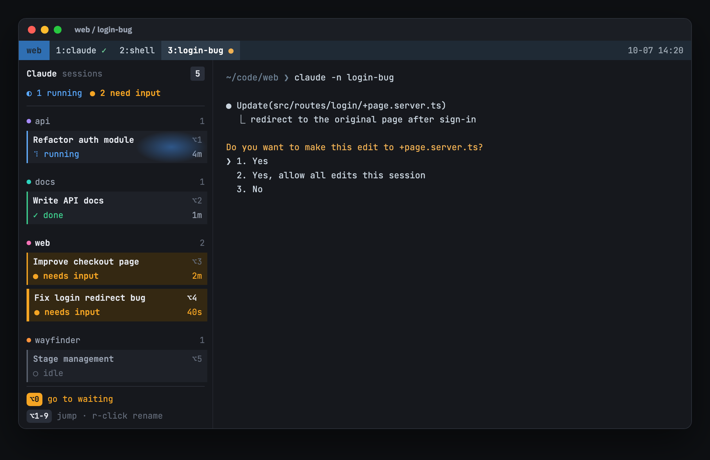

# hivemux

**English** · [한국어](README.ko.md)

**Run five Claude Code sessions at once and always know which one needs you.**

hivemux adds a sidebar to every tmux window that lists every Claude Code session
in every tmux session: what it is working on, whether it is running, waiting for
your approval, or done, and for how long. Press `Option+3` to jump to the third
one, or `Option+0` to jump to whichever has waited longest. Close the terminal or
reboot the Mac and everything comes back, with each Claude resumed in its pane.

<p align="center">
  
</p>

## Features

- **One board for every session.** Cards grouped by project, with live state and
  elapsed time. Running cards glow, waiting cards pulse amber.
- **Jump anywhere.** `Option+1..9`, `Option+0` (oldest waiting), or click a card.
- **Task names.** Shows Claude's own conversation title. Double/right click a
  card to rename it; hivemux sends `/rename` to that Claude (waits if it is busy).
- **Survives everything.** tmux keeps sessions alive when the terminal closes;
  tmux-resurrect restores layouts after a reboot and hivemux runs
  `claude --resume <id>` in the right pane.
- **Projects.** `hm ~/code/api` opens one tmux session per folder with a named
  Claude window and a shell window.
- **Open paths Claude mentions.** `Option+O` lists file paths from the pane's
  recent output; Enter opens VS Code at the line.
- **From your phone.** Optionally turns on Remote Control for every session, so
  the Claude app shows and drives the same sessions.
- **Polite installer.** Adds marked blocks to your configs and removes exactly
  those on `hivemux uninstall`.

## Requirements

- macOS (Linux likely works but is untested)
- tmux 3.3+, jq, git, python3 (Xcode Command Line Tools)
- [Claude Code](https://code.claude.com) logged in
- [Ghostty](https://ghostty.org) recommended (any terminal works if you start `tmux` yourself)

## Install

```sh
curl -fsSL https://raw.githubusercontent.com/esteban-eg-kim/hivemux/main/install.sh | bash
```

This clones hivemux into `~/.local/share/hivemux/src` and runs `hivemux setup`.
Run the same command again to update.

Homebrew:

```sh
brew install esteban-eg-kim/tap/hivemux
hivemux setup
```

`hivemux setup` asks three questions (all default to yes):

| Question | What it changes |
|---|---|
| Recommended keys | prefix `Ctrl+A` (Claude Code uses `Ctrl+B`), `\|` / `-` splits |
| Ghostty attaches to tmux | `command = hivemux-attach` in Ghostty config |
| Remote Control for all sessions | `remoteControlAtStartup` in `~/.claude/settings.json` |

It also downloads tmux-resurrect and tmux-continuum (or uses yours from
`~/.tmux/plugins`) and registers six Claude Code hooks. Run `hivemux doctor` to
check everything. Use `--yes` to accept defaults, `--no-keys`, `--no-ghostty`,
`--no-remote` to skip parts.

## Quick start

1. Open Ghostty. You are inside tmux; the sidebar is on the left.
2. `hm ~/code/api` opens project **api** with Claude running in window 1.
3. `hm ~/code/web` opens a second project. The first keeps working.
4. Watch the sidebar. `Option+0` takes you to whatever is waiting for you.
5. `prefix` then `Shift+C` adds another named Claude to the current project.
6. Close Ghostty whenever you like. Open it again and you are back where you were.

## Keys

| Key | Action |
|---|---|
| `Option+1` … `9` | jump to that Claude (any session) |
| `Option+0` / `prefix Space` | oldest waiting Claude, else oldest unseen finished one |
| click card | jump · double/right click: rename |
| `Option+O` | open a file path from recent output (Enter VS Code, Tab default app, ^F Finder, ^Y copy) |
| `prefix Shift+C` | new window with a named Claude in this folder |
| `prefix Shift+R` | Remote Control server window (start new sessions from the phone) |
| `prefix b` | hide / show sidebars |
| `prefix s` / `prefix Shift+S` | session list / full tree |
| drag the sidebar grip | resize; width is saved |

`prefix` is `Ctrl+A` with the recommended keys, otherwise tmux's `Ctrl+B`.

## How it works

| Layer | Job |
|---|---|
| Ghostty | draws. Every window runs `hivemux-attach`, which attaches to tmux |
| tmux | keeps processes alive when the terminal closes |
| tmux-resurrect + continuum | saves layouts every 5 minutes, restores on first launch |
| Claude Code hooks | write session id and state onto the tmux pane (`hivemux-hook`) |
| sidebar | reads that state every second and draws the board (`hivemux-sidebar-view`) |

On restore, `hivemux-panes` maps saved panes to Claude session ids and types
`claude --resume <id>` in each. Sessions you ended with `/exit` are not resumed.

## Troubleshooting

```sh
hivemux doctor                         # check dependencies and wiring
hivemux-panes list                     # panes hivemux will resume after reboot
tmux set -g @hivemux-anim off          # stop animations
touch ~/tmux_no_auto_restore           # skip restore on next launch
```

More in the illustrated guide: [`docs/guide.en.html`](docs/guide.en.html) ([한국어](docs/guide.html)); download it and open it in a browser.

## Uninstall

```sh
hivemux uninstall
```

Removes the hivemux blocks from `~/.tmux.conf`, Ghostty config and `~/.zshrc`,
and the hivemux hooks from Claude Code settings. Saved layouts and backups stay
in `~/.local/share/hivemux`.

## License

MIT. hivemux is an independent project and is not affiliated with or endorsed
by Anthropic. "Claude" and "Claude Code" are trademarks of Anthropic.
